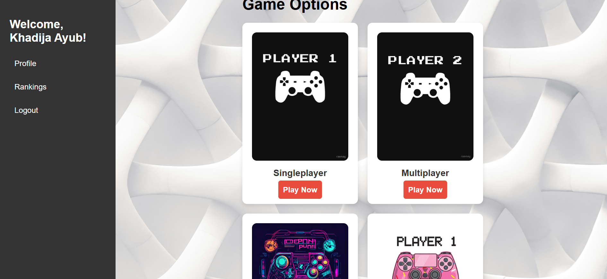

# 🎮 CyberPlay — Full-Stack Online Gaming Platform (PHP + MySQL + JS)

> A full-stack web-based gaming platform where users can register, log in, browse game categories, track their gameplay history, manage their profile with a custom avatar, and compete on a live leaderboard.


## 🚀 Highlights

- 🎮 4+ Game Categories with dynamic navigation  
- 📊 Real-time leaderboard based on gameplay  
- 👤 Profile system with avatar customization  
- ⚡ Animated UI using GSAP + smooth scrolling  
---

## 📸 Screenshots


| Landing Page | Home / Game Hub | Profile | Rankings |
|---|---|---|---|
|  |  |  |  |

---

## ✨ Features

- ✅ Animated landing page with scrolling 3D text (GSAP + Locomotive Scroll)
- ✅ User registration and login with session management
- ✅ Game hub with 4 categories: Singleplayer, Multiplayer, Action, Dress Up
- ✅ Gameplay counter — tracks how many games each user has played
- ✅ User profile page with customizable avatar selection
- ✅ Edit profile — update name and password
- ✅ Live leaderboard / rankings sorted by games played
- ✅ Fully responsive design across all pages

---

## 🛠️ Tech Stack

| Layer | Technology |
|-------|------------|
| Frontend | HTML5, CSS3, JavaScript (ES6) |
| Animations | GSAP 3, Locomotive Scroll, Canvas API |
| Backend | PHP 8 |
| Database | MySQL |
| Icons | Font Awesome 6 |
| Server | XAMPP (Apache + MySQL) |

---

## 🗂️ Project Structure

```
cyberplay/
├── index.php              ← Animated landing page
├── login.php              ← User login
├── register.php           ← User registration
├── logout.php             ← Session destroy + redirect
├── home.php               ← Game category hub (protected)
├── singleplayer.php       ← Singleplayer games listing
├── multiplayer.php        ← Multiplayer games listing
├── action.php             ← Action games listing
├── girly.php              ← Dress up games listing
├── profile.php            ← User profile view
├── edit_profile.php       ← Edit name, password, avatar
├── ranking.php            ← Leaderboard sorted by games played
├── increment_games.php    ← Tracks game clicks per user
├── web1.php               ← Avatar selection page
├── db.php                 ← Database connection
├── style.css              ← Global styles
├── script.js              ← GSAP animations + canvas effects
├── games/                 ← Game thumbnail images
├── male/                  ← Avatar image collection (300+ options)
└── database/
    └── cyberplay.sql      ← Database schema (import this)
```

---

## ⚙️ Setup & Installation

### Requirements
- XAMPP (Apache + PHP 8 + MySQL)
- Any modern browser (Chrome / Firefox)

### Steps

1. **Clone the repository**
   ```bash
   git clone https://github.com/YOUR_USERNAME/cyberplay.git
   ```

2. **Move to XAMPP's web folder**
   ```
   Copy the folder to: C:/xampp/htdocs/cyberplay
   ```

3. **Start XAMPP**
   - Open XAMPP Control Panel
   - Start **Apache** and **MySQL**

4. **Import the database**
   - Open `http://localhost/phpmyadmin`
   - Create a new database named `cyberplay`
   - Click **Import** → Choose `database/cyberplay.sql` → Click **Go**

5. **Open the app**
   ```
   http://localhost/cyberplay/
   ```

6. **Register a new account** and start exploring!

---

## 🗄️ Database Schema

The `users` table stores all user data:

| Column | Type | Description |
|--------|------|-------------|
| id | INT (PK) | Auto-increment user ID |
| name | VARCHAR | User's display name |
| email | VARCHAR | Unique email (used for login) |
| password | VARCHAR | Securely stored (hashed) user password |
| games_played | INT | Total games launched by user |
| profilePicture | VARCHAR | Path to selected avatar image |

---

## 🎯 How It Works

1. **Landing Page** — Animated intro with GSAP scroll effects and a canvas particle background
2. **Register / Login** — Creates a session storing user email, name, and games played count
3. **Game Hub** — Selecting a category takes users to a page of game thumbnails linked to external games
4. **Game Tracking** — Each game click routes through `increment_games.php` which updates the DB counter before redirecting
5. **Rankings** — Fetches all users sorted client-side by `games_played` descending
6. **Profile / Edit** — Users can view stats and change their name, password, and avatar

---

## 🚀 Future Improvements

- 📱 Improve mobile responsiveness
- 🎯 Add real-time multiplayer features

## 💡 Motivation

This project was built to simulate a real-world gaming platform with user interaction, tracking, and ranking systems. It demonstrates full-stack development skills including authentication, database management, and dynamic UI design.

## 🙋‍♀️ Author

**Khadija Ayub**
- GitHub: [@Khadija-Ayub](https://github.com/Khadija-Ayub)
- Email: khadijaayub19@gmail.com

---

## 📄 License

This project is open source and available under the [MIT License](LICENSE).
